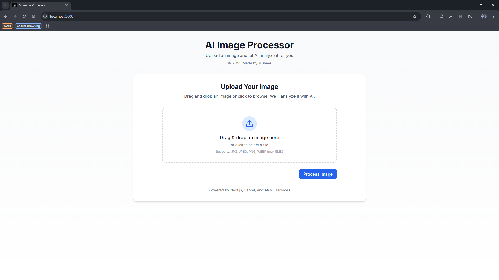
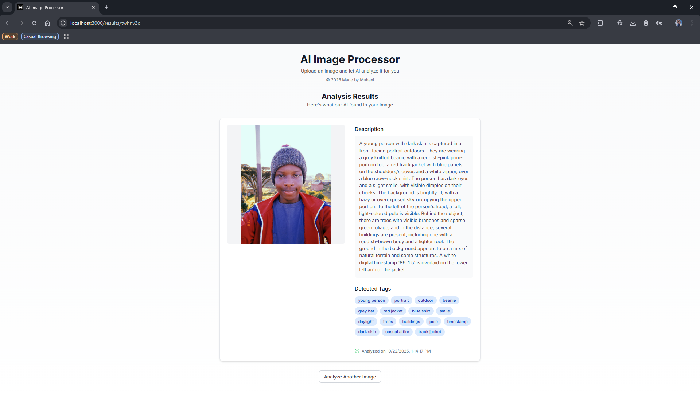

<div align="center">
  <h1>🎨 AI-Powered Image Analysis Platform</h1>
  <p>An intelligent web application that transforms images into detailed insights using cutting-edge AI technology</p>
  
  [](https://nextjs.org/)
  [](https://www.typescriptlang.org/)
  [](https://tailwindcss.com/)
  [](https://supabase.com/)
  [](https://vercel.com/)
  
  [](https://opensource.org/licenses/MIT)
  [](http://makeapullrequest.com)
  
  [](https://muhavis-ai-dip.vercel.app/)

   
</div>

## 🚀 Live Demo

Experience the application live: [https://muhavis-ai-dip.vercel.app/](https://muhavis-ai-dip.vercel.app/)

## ✨ Features

- **AI-Powered Analysis**: Leverages state-of-the-art AI models to provide detailed image analysis
- **Smart Tagging**: Automatically generates relevant tags and descriptions for uploaded images
- **Responsive Design**: Fully responsive interface that works seamlessly across all devices
- **Secure & Fast**: Built with performance and security in mind using modern web technologies
- **User-Friendly**: Intuitive drag-and-drop interface for effortless image uploads
- **Real-time Processing**: Get instant analysis results with a clean, modern UI

## Features

- 🔄 Drag and drop image upload
- 🤖 AI-powered image analysis
- 🏷️ Automatic tagging and description generation
- ⚡ Fast and responsive UI
- 🔒 Secure file handling
- 📱 Mobile-friendly design

## 🛠️ Tech Stack

### Frontend
- **Framework**: Next.js 13+ (App Router)
- **Language**: TypeScript 5.2.2
- **Styling**: Tailwind CSS 3.3.3
- **UI Components**: React Icons
- **State Management**: React Hooks & Context API

### Backend
- **Runtime**: Node.js 18+
- **API**: Next.js API Routes
- **Database**: Supabase (PostgreSQL)
- **Authentication**: Supabase Auth
- **Storage**: Supabase Storage

### DevOps
- **Version Control**: Git & GitHub
- **Deployment**: Vercel
- **CI/CD**: GitHub Actions
- **Package Manager**: npm/yarn

## 🚀 Getting Started

### Prerequisites

- Node.js 18 or later
- npm (v9+) or yarn (v1.22+)
- Supabase account (free tier available)
- Google Gemini API key (for AI analysis)

### Installation

1. Clone the repository:
   ```bash
   git clone https://github.com/yourusername/ai-image-processor.git
   cd ai-image-processor
   ```

2. Install dependencies:
   ```bash
   npm install
   # or
   yarn
   ```

3. Set up environment variables:
   - Copy `.env.local.example` to `.env.local`
   - Fill in your Supabase and AI service credentials

4. Set up your Supabase project:
   - Create a new project at https://app.supabase.com
   - Enable Row Level Security (RLS) on your tables
   - Set up a storage bucket for image uploads
   - Get your API keys and update the environment variables

5. Run the development server:
   ```bash
   npm run dev
   # or
   yarn dev
   ```

6. Open [http://localhost:3000](http://localhost:3000) in your browser to see the application.

## ⚙️ Configuration

1. Create a `.env.local` file in the root directory
2. Add the following environment variables:

```env
# Supabase Configuration
NEXT_PUBLIC_SUPABASE_URL=your_supabase_url
NEXT_PUBLIC_SUPABASE_ANON_KEY=your_supabase_anon_key
SUPABASE_SERVICE_ROLE_KEY=your_supabase_service_role_key

# Google Gemini API
GEMINI_API_KEY=your_gemini_api_key

# App Configuration
NODE_ENV=development
NEXT_PUBLIC_APP_URL=http://localhost:3000
```

## 🏗️ Project Structure

```
ai-image-processor/
├── src/
│   ├── app/                    # Next.js 13+ App Router
│   │   ├── api/                # API routes
│   │   │   └── process-image/  # Image processing endpoint
│   │   ├── results/            # Results page
│   │   ├── globals.css         # Global styles
│   │   ├── layout.tsx          # Root layout
│   │   └── page.tsx            # Home page
│   ├── components/             # Reusable components
│   └── lib/                    # Utility functions and services
├── public/                     # Static files
│   └── images/                 # Screenshots and assets
├── .github/                    # GitHub workflows
├── .husky/                     # Git hooks
├── .vscode/                    # VS Code settings
├── .eslintrc.json              # ESLint config
├── .prettierrc                # Prettier config
├── next.config.js              # Next.js config
├── package.json               # Project dependencies
└── tsconfig.json              # TypeScript config
```

## 🎯 Key Features in Detail

### 🖼️ Image Upload & Processing
- Drag and drop interface for easy image uploads
- Support for multiple image formats (JPG, PNG, WebP, etc.)
- Client-side image validation and optimization
- Real-time upload progress indicators

### 🤖 AI-Powered Analysis
- Integration with Google's Gemini AI for advanced image understanding
- Automatic generation of detailed image descriptions
- Smart tagging system for better content organization
- Confidence scoring for analysis accuracy

### 🎨 Modern UI/UX
- Clean, intuitive interface built with Tailwind CSS
- Responsive design that works on all devices
- Smooth animations and transitions
- Accessible components following WCAG guidelines

### ⚡ Performance Optimizations
- Code splitting and lazy loading
- Image optimization with Next.js Image component
- Efficient state management
- Server-side rendering for better SEO

## 📦 Installation & Setup

1. **Clone the repository**
   ```bash
   git clone https://github.com/yourusername/ai-image-processor.git
   cd ai-image-processor
   ```

2. **Install dependencies**
   ```bash
   npm install
   # or
   yarn
   ```

3. **Set up environment variables**
   ```bash
   cp .env.local.example .env.local
   # Update the environment variables with your credentials
   ```

4. **Run the development server**
   ```bash
   npm run dev
   # or
   yarn dev
   ```

5. **Open your browser**
   Visit [http://localhost:3000](http://localhost:3000) to see the application in action.

## 🚀 Deployment

This project is deployed on Vercel for seamless integration and scaling. The deployment is automated through GitHub Actions.

### Deploy Your Own

[](https://vercel.com/new/clone?repository-url=https%3A%2F%2Fgithub.com%2FMuhavii%2Fai-image-processor&env=NEXT_PUBLIC_SUPABASE_URL,NEXT_PUBLIC_SUPABASE_ANON_KEY,GEMINI_API_KEY&envDescription=Required%20environment%20variables%20for%20the%20application&envLink=https%3A%2F%2Fgithub.com%2FMuhavii%2Fai-image-processor%2Fblob%2Fmain%2F.env.local.example&project-name=ai-image-processor&repository-name=ai-image-processor)

### Environment Variables

You'll need to set up the following environment variables in your Vercel project:

- `NEXT_PUBLIC_SUPABASE_URL` - Your Supabase project URL
- `NEXT_PUBLIC_SUPABASE_ANON_KEY` - Your Supabase anon/public key
- `GEMINI_API_KEY` - Your Google Gemini API key

### Deployment Notes

- The application is configured with ISR (Incremental Static Regeneration) for optimal performance
- Edge Functions are used for API routes to ensure low-latency responses
- Image optimization is handled automatically by the Next.js Image component
- Automatic HTTPS is enabled by default on Vercel

## 🤝 Contributing

Contributions are welcome! Please read our [Contributing Guidelines](CONTRIBUTING.md) for details on our code of conduct and the process for submitting pull requests.

## 📄 License

This project is licensed under the MIT License - see the [LICENSE](LICENSE) file for details.

## 👏 Acknowledgments

- Built with ❤️ using Next.js and Supabase
- Powered by Google's Gemini AI
- Special thanks to all contributors and the open-source community

---

<div align="center">
  Made with ❤️ by Muhavi
</div>

## Integrating with AI Services

### Option 1: OpenAI CLIP

1. Sign up for an API key at [OpenAI](https://platform.openai.com/)
2. Add your API key to `.env.local`
3. Update the API route to use the OpenAI API

### Option 2: Google Cloud Vision

1. Set up a Google Cloud project and enable the Vision API
2. Create service account credentials
3. Add the credentials to your environment variables
4. Update the API route to use the Google Cloud Vision client

## Deployment

### Vercel

[](https://vercel.com/new/clone?repository-url=https%3A%2F%2Fgithub.com%2Fyourusername%2Fai-image-processor&env=NEXT_PUBLIC_SUPABASE_URL,NEXT_PUBLIC_SUPABASE_ANON_KEY,SUPABASE_SERVICE_ROLE_KEY&envDescription=Configure%20your%20Supabase%20and%20AI%20service%20credentials&envLink=https%3A%2F%2Fgithub.com%2Fyourusername%2Fai-image-processor%23environment-variables)

1. Push your code to a GitHub repository
2. Import the repository to Vercel
3. Add your environment variables in the Vercel dashboard
4. Deploy!

## License

This project is licensed under the MIT License - see the [LICENSE](LICENSE) file for details.

## Acknowledgments

- [Next.js](https://nextjs.org/)
- [Tailwind CSS](https://tailwindcss.com/)
- [Supabase](https://supabase.com/)
- [React Dropzone](https://react-dropzone.js.org/)
